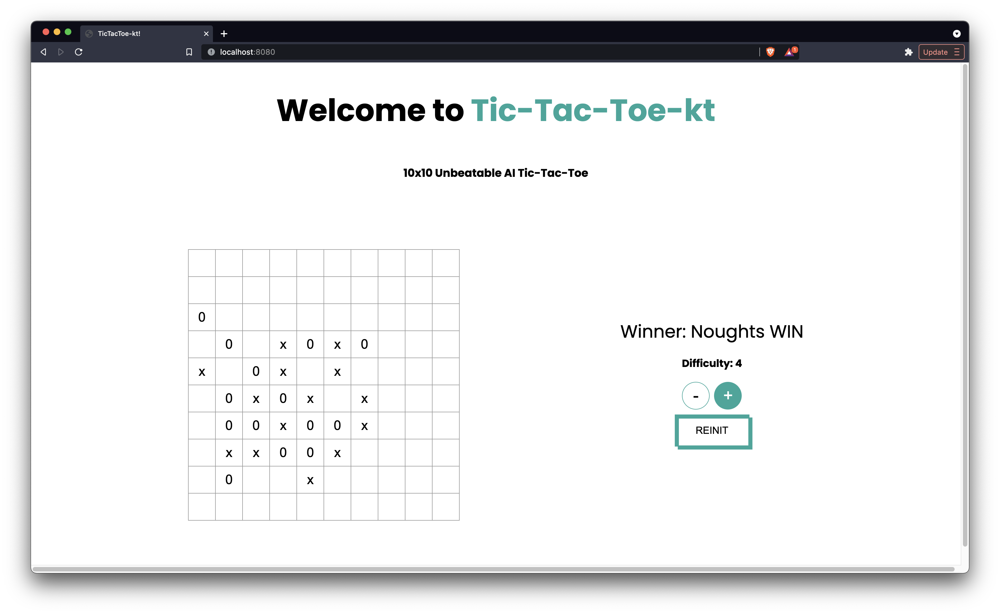

# Tic-Tac-Toe-kt

## Getting Started
1. TicTacToe 10x10 board for Human vs AI written in Kotlin.
2. AI(Optimized Minimax with Alpha-Beta Pruning) written in Kotlin.

## File Structure
The workspace contains the following folders:
- `src/jsMain` - Contains the code for core AI and game frontend. 
- `src/jvmMain` - Game Server. Game works on 8080 port by default if running on `localhost`

## Game
1. 10x10 playing field.
2. The user needs to place 5 marks in a row (horizontal, vertical or diagonal) to win. 

## AI
- The AI is build on Minimax Algorithm with Alpha-Beta Pruning with optimization to reduce the search space for moves.
- Different Difficulty Levels (1-6).
- The algorithm is inspired by FiveInARow game AI. 
- AI is unbeatable in a sense(I am not able to beat it.).

## UX
- The UX is intuitive, easy to understand, and fun.
- Minimal UI with color scheme, inspired from `NextJS`

## Results

## Limitation
- AI performs slow for higher difficulty levels. This can be solved by `coroutines` but given the time constraint this is not implemented.
- AI is working on `main` thread.

